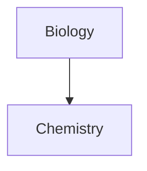

---
tags:
  - crafting
  - varinha
  - pathOfExile2
  - recombinador
---

# Ingredientes

Sempre verifique o preço dos itens que você vai usar, já que o guia não é atualizado diariamente..

| Quantidade | Item                                                                          | Preço em ![[Orbe Exaltado.png\|20]] Orbe Exaltado | Preço em ![[Orbe Divino.png\|20]]Orbe Divino |
| ---------- | ----------------------------------------------------------------------------- | ------------------------------------------------- | -------------------------------------------- |
| 1          | ![[Presságio da Recombinação.png\|20]]Presságio da Recombinação               | 36 ![[Orbe Exaltado.png\|20]]                     | 0,25 ![[Orbe Divino.png\|20]]                |
| 2          | ![[Orbe Exaltado.png\|20]] Orbe Exaltado Maior                                | 7 ![[Orbe Exaltado.png\|20]]                      | 0,04 ![[Orbe Divino.png\|20]]                |
| 2          | ![[Presságio da Exaltação Uniforme.png\|20]]Presságio da Exaltação Uniforme   | 248 ![[Orbe Exaltado.png\|20]]                    | 1,73 ![[Orbe Divino.png\|20]]                |
| 2          | ![[Presságio da Exaltação Grandiosa.png\|20]]Presságio da Exaltação Grandiosa | 4 ![[Orbe Exaltado.png\|20]]                      | 0,02 ![[Orbe Divino.png\|20]]                |
| 1          | ![[Presságio da Exaltação Hábil.png\|20]]Presságio da Exaltação Hábil         | 4 ![[Orbe Exaltado.png\|20]]                      | 0,02 ![[Orbe Divino.png\|20]]                |
 - Total 299 ![[Orbe Exaltado.png|20]] Orbe Exaltado ou 2 ![[Orbe Divino.png|20]] Orbe divino.
	- Preço do ![[Orbe Divino.png|20]] Orbe Divino no momento do guia: 143 ![[Orbe Exaltado.png|20]] Orbe Exaltado

# Receita
1. Conseguir uma base com # ao Nível de todas as Gemas Habilidades de Magias de Caos/Raio/Gelo/Fogo/Física e uma de  Dano de Caos/Raio/Gelo/Fogo/Físico aumentado em #%;
	- De preferencia para um +5 e um T6 de dano.
	1. Recombinar as duas bases no Recombinador, selecionando os 2 modificadores.
		- Você pode usar um ![[Presságio da Recombinação.png|20]]Presságio da Recombinação para aumentar suas chances;
		- Chance de 29,95% sem o ![[Presságio da Recombinação.png|20]]Presságio da Recombinação;
		- Chance de 50,92% com o ![[Presságio da Recombinação.png|20]]Presságio da Recombinação.
2. Adicionar +2 sufixos.
	1. Usar ![[Orbe Exaltado.png|20]]  Orbe Exaltado com ![[Presságio da Exaltação Uniforme.png|20]]Presságio da Exaltação Uniforme, ![[Presságio da Exaltação Grandiosa.png|20]]Presságio da Exaltação Grandiosa e ![[Presságio da Exaltação Hábil.png|20]]Presságio da Exaltação Hábil.
		- Calculo abaixo foram feito com ![[Orbe Exaltado.png|20]] Orbe Exaltado Maior;
		- 61,11% de chance de conseguir Velocidade de Conjuração;
		- 19,44% de chance de conseguir Chance de crítico para magias;
		- 19,44% de chance de conseguir Bônus de dano mágico crítico aumentado.
		- Se cair Chance de Crítico para magias ou Bônus de dano mágico crítico aumentado, a chance de cair Velocidade de Conjuração aumenta para 75,86%;
3. Adicionar +2 prefixos.
	- Existe 2 métodos para isso;
	1. Usar ![[Orbe Exaltado.png|20]] Orbe Exaltado com ![[Presságio da Exaltação Uniforme.png|20]]Presságio da Exaltação Uniforme, ![[Presságio da Exaltação Grandiosa.png|20]]Presságio da Exaltação Grandiosa.
		- 11,45% de chance de cair Dano Mágico aumentado em #%;
		- 22,90% de chance de cair Ganha #% do Dano como Dano Extra de Fogo/Gelo/Raio.
		- 19,84% de chance de cair Dano Mágico aumentado em #% e # de Mana máxima;
			- Note que se cair esse modificador primeiro, temos 53% de chance de cair # de Mana máxima.
	2. Usar uma mandíbula para tentar pegar algum modificador interessante;
		- Você pode usar um ![[Presságio dos Ecos Abissais.png|20]]Presságio dos Ecos Abissais para aumentar sua chance de encontrar algo bom.
		- Finalizar com um ![[Orbe Exaltado.png|20]] Orbe Exaltado.
4. +1 ao nível de habilidades.
	- Passo não obrigatório, mas caso queira aumentar o nível da gema para +6, essa é a única forma de conseguir.
	1. Usar um ![[Presságio da Santificação.png|20]]Presságio da Santificação com um ![[Orbe Divino.png|20]] Orbe divino.
	- 20% de chance de conseguir +1 ao nível da gema.
# Resultado final
Como existe muita chance de dar ruim o nosso craft, sempre verifique os preços dos piores resultados possíveis antes de sair tentando montar a sua própria varinha.

## O pior resultado possível
![[{F7F786AA-7F4E-42EC-8064-75E83F657A39}.png]]
![[{CA815637-3734-4A6A-AE73-1039645A3EC6}.png]]
![[{D56D2C07-4EC9-4320-96C7-7EEE75C58C9E}.png]]
## O melhor resultado possível
![[{381E1201-BF5F-4013-995A-BFDDADFCCD4A}.png]]
![[{4C07AEC7-AA10-402E-9284-8FC0E2A61DF8}.png]]
![[{DBD3673B-79FF-44F9-8AC4-7448C337AFDC}.png]]
